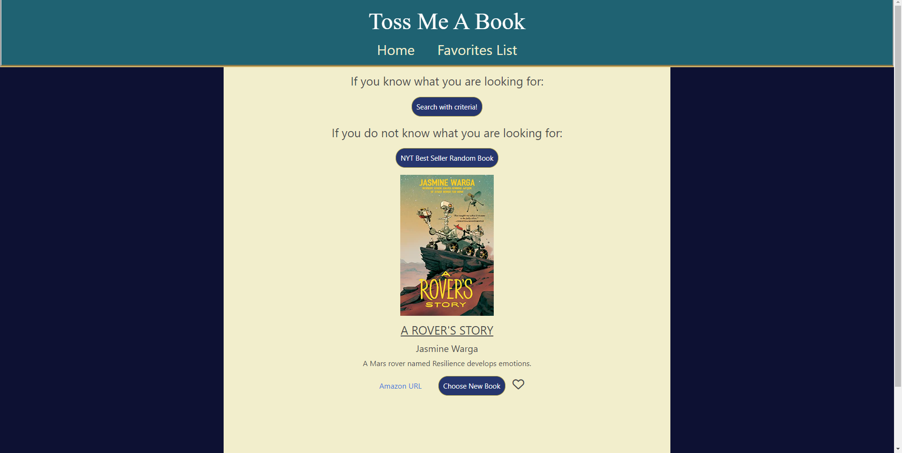
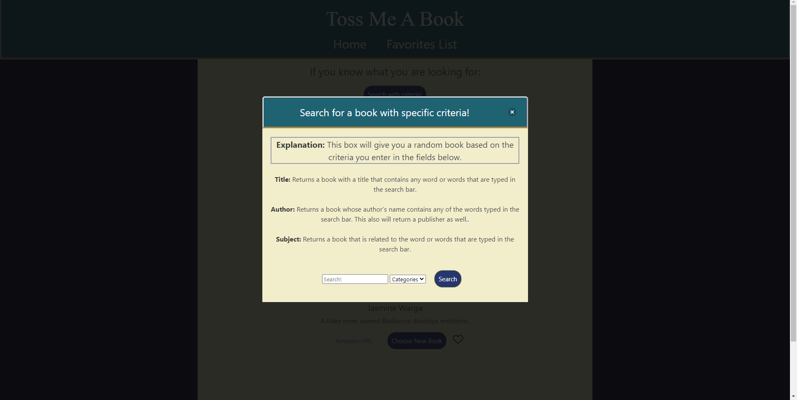
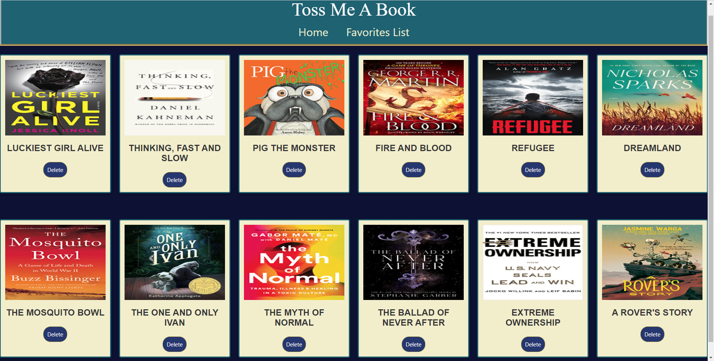

# Toss Me A Book

## Description

This application helps the user find a book in many different ways. By subject, title, author, or just have the application pick a book from The NYT best seller list that comes with a short description of the book.

In this application,
-   when the search with criteria button is clicked, a modal is diplayed with the criteria options
-   when criteria for the book is selected, a random book that meets the criteria is displayed
-   when the random book based on the criteria is displayed, the cover image, title, and authors are displayed
-   when the Choose New Book button is clicked, a new book with the previous criteria used or a new book from a Best Seller list
-   when the NYT Best Seller Random Book button is clicked, a random book from a NYT Best Seller list is displayed
-   when the random book from a Best Seller list is displayed, the cover image, title, authors, description, and the amazon URL are displayed
-   when the favorite icon is clicked, the icon turns to solid and the book is saved to the favorites list
-   in the favorites list, a list of all the books that were favorited with the cover image and title are displayed

## Technologies Used

-   [Bulma](https://bulma.io/documentation/overview/)
-   [OpenLibrary API](https://openlibrary.org/dev/docs/api/search)
-   [Books API](https://developer.nytimes.com/docs/books-product/1/overview)

## Visuals

## Deployed Link

https://camdenz2k3.github.io/Toss-Me-A-Book-/